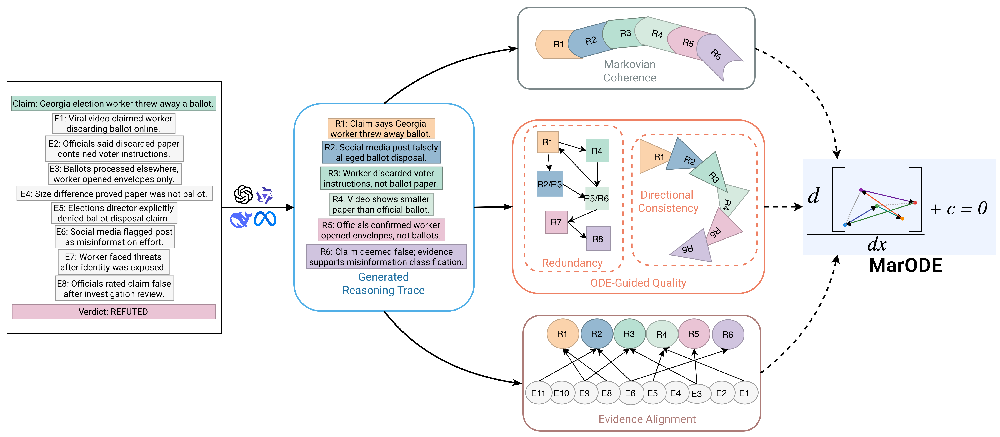

# MarODE  

## Markovian ODE-Guided Scoring for Offline Reasoning Trace Evaluation

MarODE is a theory-driven, post-hoc evaluation framework for assessing the **quality of reasoning traces** produced by large language models (LLMs).

Unlike traditional metrics that focus on final answer correctness or surface similarity, MarODE evaluates the *structure, progression, and evidential grounding* of multi-step reasoning.

## Motivation

Reasoning traces (e.g., Chain-of-Thought) are increasingly used in:

- Mathematical reasoning  
- Multi-hop QA  
- Fact verification  
- Logical inference  
- Strategic reasoning  

However, evaluating reasoning quality remains challenging.

Existing approaches:

- Rely on surface similarity
- Overfit to mechanical perturbations
- Fail to generalize across reasoning styles
- Do not align reliably with human judgments

MarODE addresses this by modeling reasoning as:

- A **Markovian semantic progression**
- A **redundancy-aware structural process**
- An **evidence-grounded inferential chain**

## What Does MarODE Measure?

MarODE evaluates:

- The *direction* of reasoning  
- The *structure* of progression  
- The *consistency* of inferential flow  

It is independent of the final answer alone.

## Core Components

Given a reasoning trace:
$$
r = \{R_0, R_1, \dots, R_k, V_f\}
$$
MarODE integrates three complementary modules.

## Markovian Coherence (α)

Models local semantic progression between reasoning steps.

- Steps are embedded into a normalized space.
- A cosine-based transition matrix defines a Markov chain.
- 256 random walks are simulated.
- Walks are rewarded for monotonic transitions (i → i±1).
- Oscillation and jumps are penalized.

This is the strongest driver of performance in our ablations.

---

## ODE-Guided Quality Modeling (β)

Captures global reasoning dynamics through two mechanisms:

### (a) Redundancy Control

- Penalizes repeated lexical content across steps.
- Encourages incremental informational contribution.

### (b) Directional Consistency (Continuous Belief Modeling)

Instead of multiplicative probability updates, we model belief evolution via:
$$
\frac{dp}{dt} = \rho \left(S_i - 0.5\right) p(1 - p)
$$
where:
- $S_i$ is the NLI-based entailment–contradiction signal.
- p(t) ∈ (0,1) is latent belief strength

**Why ODE?**

- Avoids brittle multiplicative collapse
- Produces smooth trajectories
- Reduces volatility under oscillating reasoning
- Ensures stability across long chains

## Evidence Alignment (γ)

Grounds reasoning in external evidence.

For each step:

- Find most similar evidence sentence
- Refine alignment using NLI:
  - Reward entailment
  - Penalize contradiction

This mitigates hallucinated or unsupported reasoning.

## Final Aggregation

MarODE combines the three components:

$$
\text{MarODE}(r) = w_c \, C(r) + w_q \, Q(r) + w_e \, E(r)
$$

Default:

$$
w_c = w_q = w_e = \frac{1}{3}
$$

Ablation studies show:

- Coherence ($\alpha$) is the dominant signal.
- ODE quality ($\beta$) stabilizes evaluation.
- Evidence ($\gamma$) plays a secondary, context-dependent role.

## Empirical Findings

Across:

- 25,800 generated reasoning traces
- 5 reasoning-optimized LLMs
- 1, 2, and 4-shot prompting
- Human-centric perturbations
- 4 human-evaluated reasoning benchmarks

MarODE demonstrates:

### Goodness (Sensitivity to Degradation)

- 235%–279% improvement in Somers’ D over ROSCOE
- Stable across datasets and model families
- Robust to perturbation variations

### Soundness (Alignment with Human Judgments)

- Strongest correlations on:
  - EntailmentBank
  - ProofWriter
  - GSM8K
  - StrategyQA
- Statistically significant across domains

### Stability

- Smooth, symmetric score distributions
- Reduced sensitivity to prompt shot variation
- No collapse under oscillating reasoning

## Authors

- **Arghodeep Nandi**  
- **Ojasva Saxena**  
- **Tanmoy Chakraborty**  

**Indian Institute of Technology Delhi**